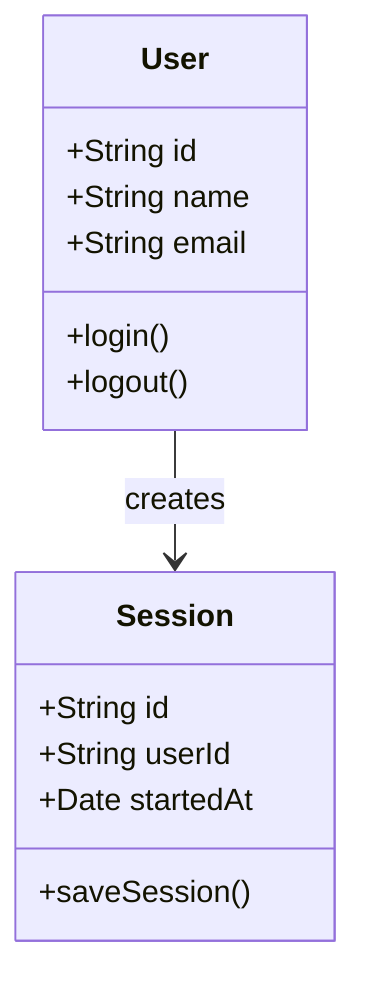
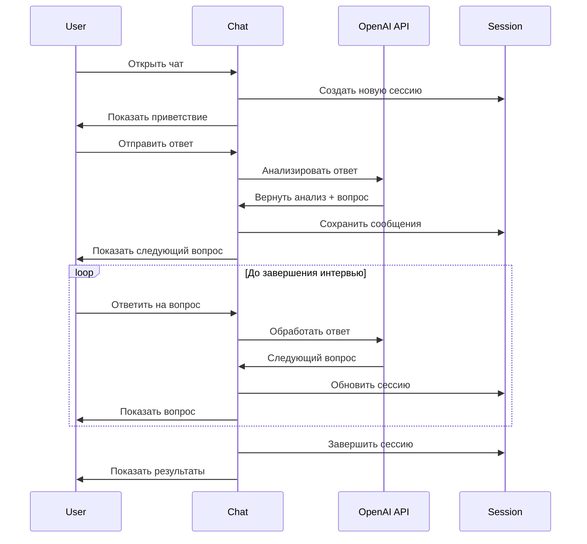
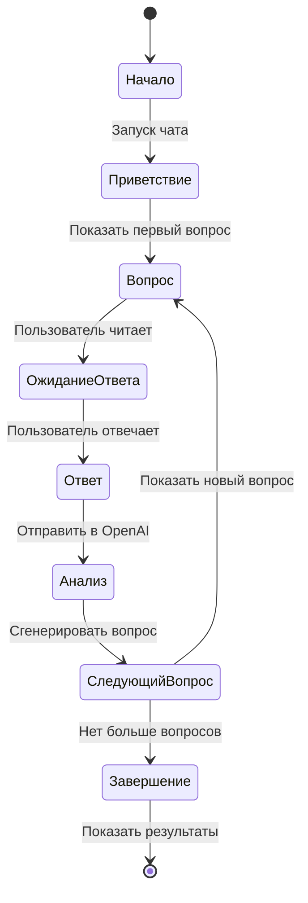
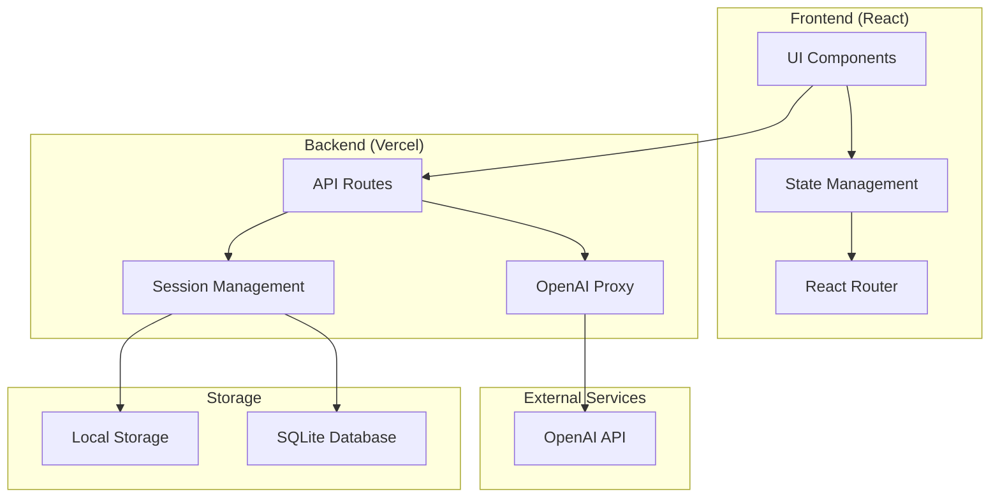
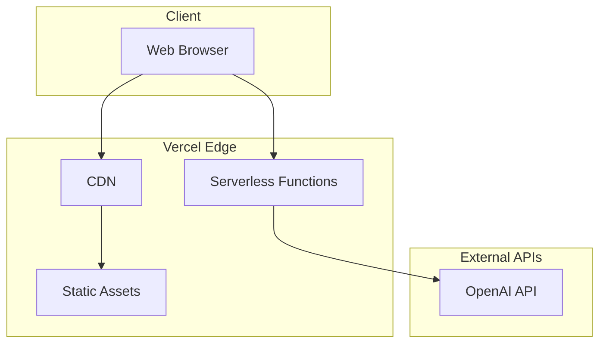
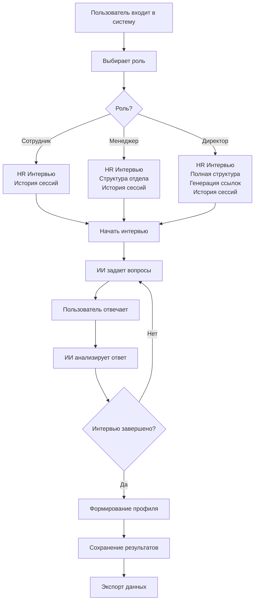
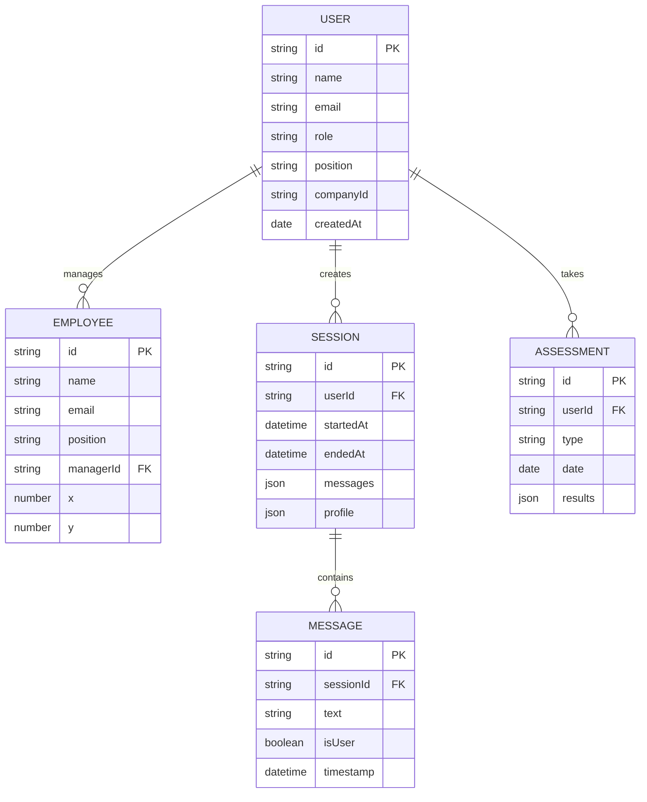

# HR Chat Companion - Документация проекта

## 📋 Содержание
1. [Описание проекта](#описание-проекта)
2. [Структура проекта](#структура-проекта)
3. [Функциональные требования](#функциональные-требования)
4. [Нефункциональные требования](#нефункциональные-требования)
5. [UML диаграммы](#uml-диаграммы)
6. [Техническая архитектура](#техническая-архитектура)
7. [API документация](#api-документация)

---

## 🎯 Описание проекта

**HR Chat Companion** — это веб-приложение для автоматизации HR-процессов, включающее ИИ-ассистента для проведения интервью, систему управления организационной структурой и профилями сотрудников.

### Основные возможности:
- **ИИ-интервью**: Автоматизированные собеседования с кандидатами
- **Управление персоналом**: Визуализация оргструктуры и иерархии
- **Профили пользователей**: Система ролей и прав доступа
- **Аналитика**: Автоматическое формирование профилей кандидатов

---

## 🏗️ Структура проекта

```
hr-chat-companion-main/
├── 📁 src/
│   ├── 📁 components/          # React компоненты
│   │   ├── 📁 ui/             # UI компоненты (shadcn/ui)
│   │   ├── AIAssessment.tsx   # Компонент ИИ-оценки
│   │   ├── AuthForm.tsx       # Форма авторизации
│   │   ├── ChatInput.tsx      # Ввод сообщений
│   │   ├── ChatMessage.tsx    # Отображение сообщений
│   │   ├── Employees.tsx      # Управление сотрудниками
│   │   ├── HRChat.tsx         # Основной чат с ИИ
│   │   ├── OrgChart.tsx       # Организационная диаграмма
│   │   ├── UserProfile.tsx    # Профиль пользователя
│   │   ├── RAGInterview.tsx   # RAG собеседование
│   │   ├── KnowledgeBase.tsx  # База знаний
│   │   └── CandidateProfileView.tsx # Просмотр профиля кандидата
│   ├── 📁 constants/          # Константы и конфигурация
│   │   ├── checklists.ts      # Чек-листы для оценки
│   │   └── storage.ts         # Ключи для localStorage
│   ├── 📁 hooks/              # React хуки
│   │   ├── use-mobile.tsx     # Хук для мобильных устройств
│   │   └── use-toast.ts       # Хук для уведомлений
│   ├── 📁 lib/                # Библиотеки и утилиты
│   │   ├── employees.ts       # Управление сотрудниками
│   │   ├── seed.ts            # Начальные данные
│   │   ├── session.ts         # Управление сессиями
│   │   └── utils.ts           # Общие утилиты
│   ├── 📁 pages/              # Страницы приложения
│   │   ├── Index.tsx          # Главная страница
│   │   └── NotFound.tsx       # Страница 404
│   ├── 📁 types/              # TypeScript типы
│   │   ├── assessment.ts      # Типы для оценки
│   │   ├── competency.ts      # Типы компетенций
│   │   ├── employee.ts        # Типы сотрудников
│   │   └── profile.ts         # Типы профилей
│   └── 📁 utils/              # Утилиты
│       └── test-utils.ts      # Утилиты для тестирования
├── 📁 public/                 # Статические файлы
├── 📄 package.json            # Зависимости проекта
├── 📄 server.js               # Express сервер
├── 📄 vercel.json             # Конфигурация Vercel
├── 📄 netlify.toml            # Конфигурация Netlify
├── 📄 vite.config.ts          # Конфигурация Vite
└── 📄 tailwind.config.ts      # Конфигурация Tailwind
```

---

## ✅ Функциональные требования

### 1. Система аутентификации
- **FR-001**: Регистрация новых пользователей
- **FR-002**: Вход в систему по email
- **FR-003**: Управление ролями (сотрудник/менеджер/директор)
- **FR-004**: Выход из системы

### 2. Профили пользователей
- **FR-005**: Создание и редактирование профиля
- **FR-006**: Управление личной информацией
- **FR-007**: Настройка роли и должности
- **FR-008**: Генерация инвайт-ссылок (для директоров)

### 3. ИИ-чат для интервью
- **FR-009**: Запуск автоматизированного интервью
- **FR-010**: Генерация контекстных вопросов
- **FR-011**: Анализ ответов кандидатов
- **FR-012**: Автоматическое формирование профиля
- **FR-013**: Сохранение истории интервью

### 4. Управление сотрудниками
- **FR-014**: Просмотр организационной структуры
- **FR-015**: Добавление новых сотрудников
- **FR-016**: Редактирование информации о сотрудниках
- **FR-017**: Управление иерархией (менеджер-подчинённый)
- **FR-018**: Drag & Drop перемещение сотрудников

### 5. Система оценки
- **FR-019**: Проведение оценки компетенций
- **FR-020**: Использование чек-листов
- **FR-021**: Генерация отчётов по оценке
- **FR-022**: Экспорт результатов

### 6. История и аналитика
- **FR-023**: Просмотр истории сессий
- **FR-024**: Фильтрация по датам и пользователям
- **FR-025**: Экспорт данных в различные форматы
- **FR-026**: Статистика использования системы

---

## 🚀 Нефункциональные требования

### 1. Производительность
- **NFR-001**: Время отклика интерфейса < 200ms
- **NFR-002**: Время загрузки страницы < 3 секунд
- **NFR-003**: Поддержка до 1000 одновременных пользователей
- **NFR-004**: Обработка до 100 сообщений в минуту

### 2. Надёжность
- **NFR-005**: Доступность системы 99.5%
- **NFR-006**: Автоматическое сохранение данных
- **NFR-007**: Обработка ошибок API без падения
- **NFR-008**: Валидация входных данных

### 3. Безопасность
- **NFR-009**: Защита API ключей OpenAI
- **NFR-010**: Валидация пользовательского ввода
- **NFR-011**: Разграничение доступа по ролям
- **NFR-012**: Безопасное хранение сессий

### 4. Удобство использования
- **NFR-013**: Адаптивный дизайн для всех устройств
- **NFR-014**: Интуитивно понятный интерфейс
- **NFR-015**: Поддержка клавиатурной навигации
- **NFR-016**: Многоязычность (русский/английский)

### 5. Масштабируемость
- **NFR-017**: Возможность добавления новых ролей
- **NFR-018**: Расширение функционала оценки
- **NFR-019**: Интеграция с внешними HR-системами
- **NFR-020**: Поддержка множественных организаций

---

## 📊 Диаграммы и схемы

### 1. Диаграмма классов (упрощенная)
Основные сущности системы и их взаимосвязи:



### 2. Диаграмма последовательности - ИИ-интервью
Процесс проведения автоматизированного интервью:



### 3. Диаграмма состояний - Процесс интервью
Состояния и переходы в процессе интервью:



### 4. Диаграмма компонентов
Архитектура системы и взаимодействие компонентов:



### 5. Диаграмма развёртывания
Инфраструктура и развёртывание приложения:



### 6. Схема пользовательских сценариев
Основные пути использования системы:



### 7. ER-диаграмма базы данных
Структура данных и связи между таблицами:



---

## 🏗️ Техническая архитектура

### Frontend
- **Framework**: React 18 + TypeScript
- **Build Tool**: Vite
- **Styling**: Tailwind CSS + shadcn/ui
- **State Management**: React Hooks + Context
- **Routing**: React Router DOM

### Backend
- **Platform**: Vercel Serverless
- **Runtime**: Node.js 18+
- **API**: Express.js middleware
- **Database**: SQLite (local) + LocalStorage

### External Integrations
- **AI**: OpenAI GPT-4 API
- **Deployment**: Vercel

---

## 🔌 API документация

### OpenAI Proxy (`/api/openai`)
```typescript
POST /api/openai
{
  "model": "gpt-4o-mini",
  "messages": [...],
  "max_tokens": 800,
  "temperature": 0.7
}
```

### Sessions API (`/api/sessions`)
```typescript
GET /api/sessions?userId={id}
POST /api/sessions/upsert
POST /api/sessions/clear
```

---

## 📱 Пользовательские сценарии

### Сценарий 1: Проведение ИИ-интервью
1. Пользователь входит в систему
2. Переходит в раздел "HR Чат"
3. Нажимает "Начать интервью"
4. ИИ задаёт первый вопрос
5. Пользователь отвечает
6. ИИ анализирует ответ и задаёт следующий вопрос
7. Процесс повторяется до завершения
8. Система формирует профиль кандидата

### Сценарий 2: Управление оргструктурой
1. Менеджер входит в систему
2. Переходит в "Структура моего отдела"
3. Просматривает текущую структуру
4. Добавляет нового сотрудника
5. Перетаскивает сотрудника в нужный отдел
6. Сохраняет изменения

### Сценарий 3: Экспорт данных
1. Пользователь открывает историю сессий
2. Выбирает нужные сессии
3. Нажимает "Экспорт"
4. Выбирает формат (JSON, CSV)
5. Скачивает файл

---

## 🔮 Планы развития

### Краткосрочные (1-3 месяца)
- [ ] Интеграция с календарными системами
- [ ] Расширение языковой поддержки
- [ ] Улучшение UI/UX

### Среднесрочные (3-6 месяцев)
- [ ] Мобильное приложение
- [ ] Интеграция с HR-системами
- [ ] Расширенная аналитика

### Долгосрочные (6+ месяцев)
- [ ] AI-анализ видеоинтервью
- [ ] Прогнозирование успешности кандидатов
- [ ] Интеграция с системами управления талантами

---

## 📞 Контакты и поддержка

- **Разработчик**: HR Assistant Team
- **Версия**: 1.0.0
- **Дата создания**: 2024
- **Лицензия**: MIT

---

*Документация обновлена: 14.08.2024* 